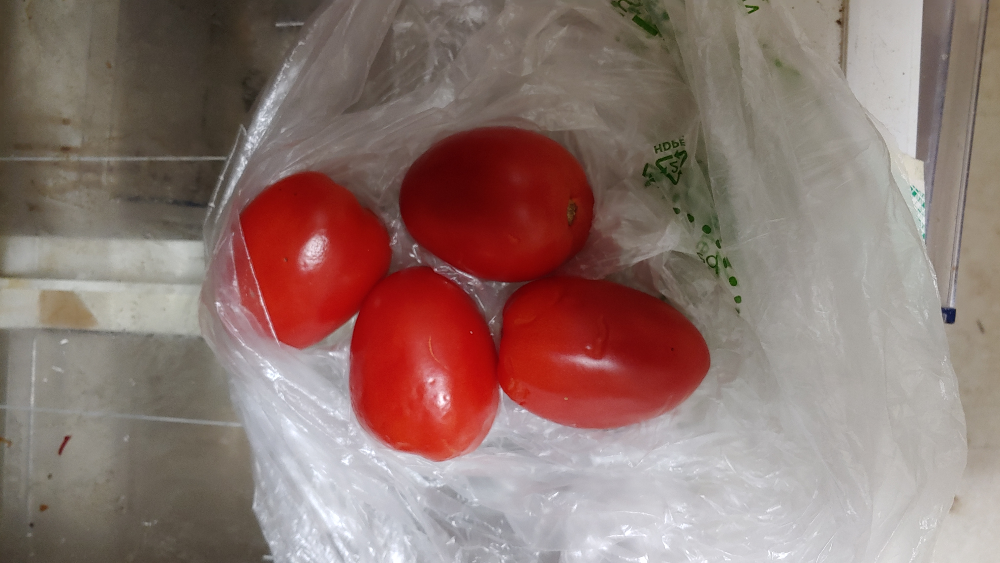

# RecipeLive
Recipe recommendation application based on the produce you have.

**Focus**: Image  Classification (w/ CNN), Text Classification (w/ NLP), Web Scraping, Data Engineering, and _Design-to-Product_ Pipeline

> **Problem Statement:** 
>
> - What dish can I cook tonight, using the produce I have in my refrigerator? 

### Project Description

I spend a lot of time looking for recipes that would match the ingredients I have in my refrigerator.  Sometimes ~30 minutes is spent on google searching, to get the one that's reasonable based on ingredients, prep time, nutritonal values, etc. I often feel that most cooking sites and mobile apps have too many functionalities to navigate through. So, I thought, *"Wouldn't it be nice to have a personalized recipe-finder that simply takes ingredient photos as the input ?"* I wanted to take a stab at this problem, i.e., building a recipe-finder that's personalized to my preferences.

- [x] **Tasks:**
  - [x] Collect recipes (text data) by webscraping _Epicurious_. Scraped info includes recipe title, -ingredients, -instructions, nutritional values, and photos  
  - [x] Collect images using Google API, for training a CNN model    
  - [x] Build a neural network-based image classifier of produce
  - [x] Perform topic modeling analysis for recipe-tagging, i.e., grouping them into different dish categories  
  - [x] Build a Flask app and a script that loads images from mail inbox to a folder on server for model prediction
  
  
  
  
**Code, notebooks, and documents**

- [Project_Presentation.pptx](./docs/RecipeLive.pptx), or [PDF](./docs/RecipeLive.pdf) - project report on powerpoint (or pdf) formats 
- [Step1_DataAcquisition.ipynb](./notebooks/DataGathering.ipynb) - collecting images from google
- [Step2_recipe_scrapper.py](./scripts/recipe_scrapper.py) - Scrapped a recipe website
- [Step3_Data Cleaning.ipynb](./notebooks/data_cleaning.ipynb) - preprocessing of the dataset
- [Step4_EDA_and_TopicModeling.ipynb](./notebooks/EDA_and_topicmodeling.ipynb) - EDA and _topic modeling_ of recipe titles 
- [Step5_ImageClassification.ipynb](./notebooks/ImageClassification.ipynb) - Image classification
- [Step5_End-to-end-pipeline.ipynb](./notebooks/End_to_endpipeline.ipynb) - example script of how images are fed into the model > output as text > key-search of tagged recipes

**Pictures used for test**
 <!-- .element height="50%" width="50%" -->

